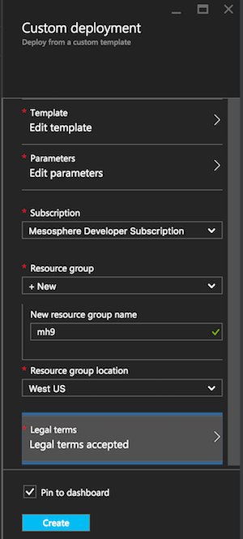

# Using Azure Storage on DCOS for HA

Shows how to use Azure Storage on DCOS for highly available services/stateful failover.

## DCOS cluster

First, using an [ARM template](https://portal.azure.com/#create/Microsoft.Template/uri/https%3A%2F%2Fgist.githubusercontent.com%2Fmhausenblas%2Fa8247ecf4a791813626a%2Fraw%2F673cc5a69791e078c82f806a58ce44d344b38e29%2Fazuredeploy.nojumpbox.json), launch a DCOS cluster on Azure. Note: in the ARM template `containerService.properties.orchestratorProfile.orchestratorType` has changed from `openDcosPreview` to `DcosPreview`, see https://gist.github.com/mhausenblas/a8247ecf4a791813626a for a patch.

After launching the ARM template, in the parameters you must set the DNS prefix (`jenkins` in my case) and, assuming you generated an [SSH key pair](https://azure.microsoft.com/en-us/documentation/articles/virtual-machines-linux-use-ssh-key/) locally already, you need to provide your public key in the template. To do that, replace the value for `sshRSAPublicKey` with something like `ssh-rsa AAAAB...UcyupgH azureuser@linuxvm` (using your own public key value). The result should looks like so:

Further, you need to create a new resource group (`mh9` for me) and accept the terms:

## Azure Storage/File Share

First, you need to create a [Storage Account](https://portal.azure.com/#create/Microsoft.StorageAccount-ARM), in my case `mh9storage`, in the same resource group that you have launched your DCOS cluster in (`mh9` here):

Now you can create a file share (`jenkins` was what I chose):

## Mounting the File Share

Now log into the DCOS master node: for that, look up SSH connection string labeled `SSHMASTER0` in the `Microsoft.Template` deployments `Outputs` section 

Now we add the private SSH key locally:

    $ ssh-add ~/.ssh/azure
    Identity added: /Users/mhausenblas/.ssh/azure (/Users/mhausenblas/.ssh/azure)

And log into the master node (note that `-L 8000:localhost:80` is a port forward from the local machine):

    $ ssh azureuser@jenkinsmgmt.westus.cloudapp.azure.com -A -p 2200 -L 8000:localhost:80
    The authenticity of host '[jenkinsmgmt.westus.cloudapp.azure.com]:2200 ([13.93.223.224]:2200)' can't be established.
    ECDSA key fingerprint is SHA256:HxdaOUroSwTMKA5x0OR9pB29GejAc9YnxRD8HDNg0Lw.
    Are you sure you want to continue connecting (yes/no)? yes
    Warning: Permanently added '[jenkinsmgmt.westus.cloudapp.azure.com]:2200,[13.93.223.224]:2200' (ECDSA) to the list of known hosts.
    Welcome to Ubuntu 15.10 (GNU/Linux 4.2.0-34-generic x86_64)
    
     * Documentation:  https://help.ubuntu.com/
     
      Get cloud support with Ubuntu Advantage Cloud Guest:
        http://www.ubuntu.com/business/services/cloud
        
    14 packages can be updated.
    4 updates are security updates.
    
    
    The programs included with the Ubuntu system are free software;
    the exact distribution terms for each program are described in the
    individual files in /usr/share/doc/*/copyright.

    Ubuntu comes with ABSOLUTELY NO WARRANTY, to the extent permitted by
    applicable law.

    To run a command as administrator (user "root"), use "sudo <command>".
    See "man sudo_root" for details.

    azureuser@dcos-master-415F65E0-0:~$

Make sure the right Ubuntu version is installed (that should be 14 or above):

    azureuser@dcos-master-415F65E0-0:~$ cat /etc/*-release | grep DISTRIB_RELEASE
    DISTRIB_RELEASE=15.10

On this node you can now [mount the File Share](https://azure.microsoft.com/en-us/documentation/articles/storage-how-to-use-files-linux/) we created in the previous step. First, let's make 100% sure that the CIFS mount utils are available:

    $ sudo apt-get update && sudo apt-get -y install cifs-utils

Now we can mount the file share:

    azureuser@dcos-master-415F65E0-0:~$ sudo mkdir -p /mnt/jenkins
    azureuser@dcos-master-415F65E0-0:~$ sudo mount -t cifs //mh9storage.file.core.windows.net/jenkins /mnt/jenkins -o vers=3.0,username=mh9storage,password=4VWsqPiYJa/JfVqkIBsDIudw5vI6W+ZxfhJPjg9C1rYi9d/dnUjAz0h8N2oc/gxyoIBmrxNCb4O6bCoiXK+DLA==,dir_mode=0777,file_mode=0777

The generic form of the command is `mount -t cifs //myaccountname.file.core.windows.net/mysharename /somedir -o vers=3.0,username=myaccountname,password=StorageAccountKeyEndingIn==,dir_mode=0777,file_mode=0777` and the password is the `KEY2` from the `Access keys` here:

To check if the file share works, we upload a test file via the Azure portal:

… and then list the content of the mounted file share on the DCOS master node:

    azureuser@dcos-master-415F65E0-0:~$ ls -al /mnt/jenkins
    total 1
    -rwxrwxrwx 1 root root 19 Mar 20 11:21 test.txt

BTW, you could use the following shell script `init_jenkins_mountpoint.sh` to make sure the mount point exists:

    JENKINS_MOUNTPOINT=/mnt/jenkins
    if [ ! -d "$JENKINS_MOUNTPOINT" ]; then
        mkdir -p $JENKINS_MOUNTPOINT
    fi
